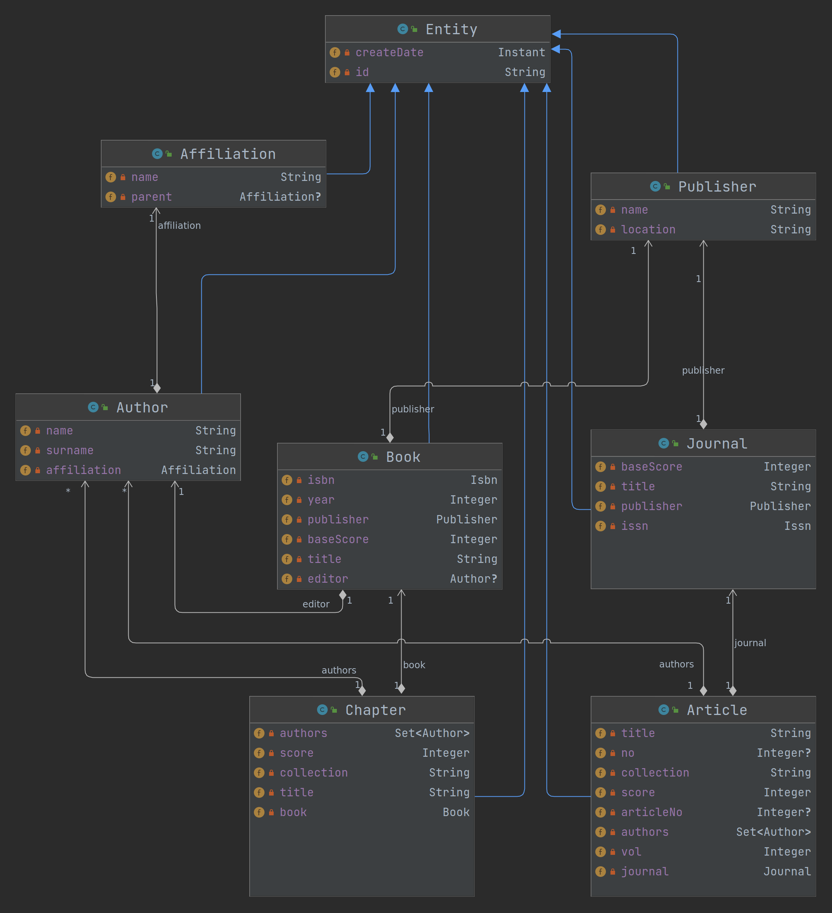

# mng-zad3-script-engine

## HATEOAS

HATEOAS, czyli Hypermedia as the Engine of Application State, to koncepcja w architekturze RESTful API, która sugeruje,
że odpowiedzi z serwera powinny zawierać nie tylko dane, ale także informacje o tym, jak te dane można manipulować.

W praktyce, HATEOAS polega na dołączaniu do odpowiedzi linków (href), które wskazują na możliwe następne akcje, które
klient może podjąć. Te linki są często zwracane w formacie JSON jako obiekt "_links", który zawiera różne relacje i
odpowiadające im adresy URL.

Na przykład, odpowiedź z serwera może wyglądać tak:

```json
{
  "surname": "Waszkowiak",
  "name": "Norbert",
  "pesel": "97541276378",
  "_links": {
    "self": {
      "href": "http://localhost:8080/api/authors/665215f08641905609b1ad39"
    },
    "author": {
      "href": "http://localhost:8080/api/authors/665215f08641905609b1ad39"
    },
    "articles": {
      "href": "http://localhost:8080/api/authors/665215f08641905609b1ad39/articles"
    }
  }
}
```

W tym przypadku, klient otrzymuje nie tylko informacje o autorze (name, surname, pesel), ale także linki do zasobów
związanych
z tym użytkownikiem: link do samego siebie (self) i link do listy artykułów (article).

HATEOAS jest jednym z kluczowych elementów architektury REST i pomaga w tworzeniu bardziej elastycznych i łatwiejszych
do utrzymania API.

## Script engine

Script Engine to interpretator języka programowania komputerowego, którego funkcją jest interpretacja tekstu programów
pochodzącego od użytkowników, tłumaczenie takiego tekstu na kod maszynowy wykonywalny przez komputery oraz realizacja
szeregu funkcji.

W praktyce jest on wykorzystywany jako interfejs do wpływania w zaawansowany (nieprzewidziany w trakcie
implementacji) sposób w stan systemu informatycznego. Przykładowo jest to korekcja danych znajdujących się w systemie
lub wywoływanie zadań znajdujących się w harmonogramie (ang. scheduling) realizujących np. integracje z systemami
zewnętrznymi.

### GrallVM

GraalVM to maszyna wirtaulna oraz platforma stworzona przez firmę Oracle. Zapewnia ona środowisko uruchomieniowe dla
wielu języków programowania, takich jak Java, JavaScript, Python, Ruby, R oraz innych. Głównym celem GraalVM jest
umożliwienie programistom korzystania z różnych języków programowania i integracji ich w jednym projekcie. Dzięki temu
można pisać aplikacje, które wykorzystują różne języki jednocześnie, co daje większą elastyczność i umożliwia wybór
najlepszego narzędzia do konkretnego zadania.

GraalVM oferuje także kompilację just-in-time (JIT) oraz ahead-of-time (
AOT), co pozwala na optymalizację wydajności aplikacji. Dzięki temu programy uruchamiane na GraalVM mogą być szybsze niż
te uruchamiane na tradycyjnych maszynach wirtualnych.

### Aby używać javy w wersji GrallVM należy zainstalować za pomocą SDKMAN

```bash
curl -s "https://get.sdkman.io" | bash
source "$HOME/.sdkman/bin/sdkman-init.sh"
sdk install java 17.0.11-graal
sdk use java 17.0.11-graal
```

### Urchomienie aplikacji

```bash
./gradlew clean build bootRun
```

### Zapewnienie obsługi JS w GraalVM

```bash
gu install js
```

### Przykład skryptów JS w silniku GraalVM.

```js
var Article = Java.type('pl.edu.wat.knowledge.entity.Article');
var Author = Java.type('pl.edu.wat.knowledge.entity.Author');
var Set = Java.type('java.util.Set');

var patrycjaAuthor = new Author();
patrycjaAuthor.setName("Patrycja");
patrycjaAuthor.setSurname("Woda");
patrycjaAuthor.setPesel("123123123");
authorRepository.save(patrycjaAuthor).getId();
```

```js
// Pobierz wszystkich autorów
var authors = authorRepository.findAll();

// Iteruj przez wszystkich autorów
for (var i = 0; i < authors.size(); i++) {
    var author = authors.get(i);

    // Zmień liczbę punktów autora na losową wartość od 1 do 10
    var newScore = Math.floor(Math.random() * 10) + 1;
    author.setScore(newScore);

    // Zapisz autora z powrotem do bazy danych
    authorRepository.save(author);

    // Loguj informacje o autorze do konsoli
    console.log("Updated author " + author.getName() + " " + author.getSurname() + " with new score: " + newScore);
}

// Zwróć liczbę zmodyfikowanych autorów
authors.size();
```

# Zadania

Wyjątkowo zadanie nie jest automatycznie sprawdzane przez testy jednostkowe.

1. **[15pkt.]** Zaimplementuj/uzupełnij encje zgodnie z umieszczonym poniżej schematem.
2. **[15pkt.]** Napisz skrypt w pythonie lub bashu, który uzpełni dane w repozytorium aplikacji za pomocą restAPI.
   Łącznie dodaj 100 rekordów różnego typu.
3. **[15pkt.]** Uzupełnij `setUpDatabase` w `AbstractContainerBaseTest` o kolejne przykładowe rekordy. Łącznie dodaj 100 rekordów różnego typu.
4. **[15pkt.]** Uzupełnij `ScoreService` o metodę `getScore(Author)`, która zwróci punkty autora uzyskane w danym roku.
   Załużmy, że jest to suma 4 najwyżej punktowane publikacji (artykuły/rozdziały) w danym roku. W przypadku autorstwa
   zbiorowego liczba punktów jest dzielona równo pomiędzy wszystkich autorów.
5. **[10pkt.]** Napisz testy jednostkowe dla metody `getScore(Author)`. Rozszerz klasę `AbstractContainerBaseTest`,
      która zapewni Ci dostęp do kontekstu Springa oraz bazy danych.
6. **[15pkt.]** Uzupełnij `ScriptService` zgodnie z nowym schematem encji oraz uwzględnij w nim korzystanie z
   serwisu `ScoreService`.
7. **[15pkt.]** Napisz skrypt w JS, który w każdym autorze uzupełni liczbę punktów na podstawie
   metody `getScore(Author)`. Zamieść skrypt w pliku `updateAuthorsScore.js`. Skrypt ma być wykorzystany w endpoincie wystawionym przez `ScriptController`.
8. **[10pkt.]** Napisz testy jednostkowe dla skryptu `updateAuthorsScore.js`. Rozszerz
   klasę `AbstractContainerBaseTest`, która zapewni Ci dostęp do kontekstu Springa oraz bazy danych.

